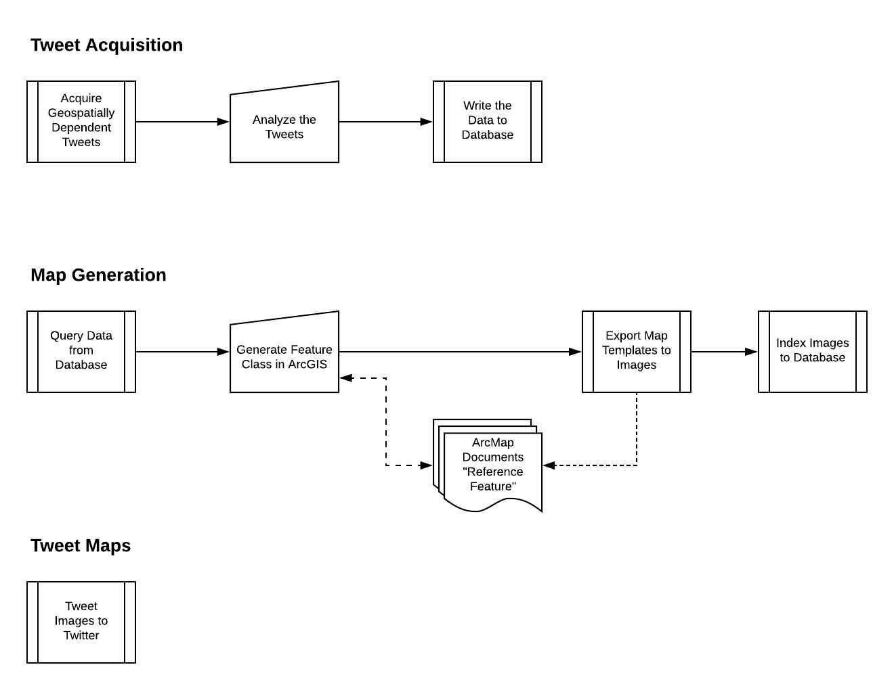

:skip-help: true
:data-transition-duration: 1500

.. title:: GIS

----

Overview of One Implementation for Twitter Based GeoSentiment Analysis
======================================================================

By: M. Hernandez, PhD

----

Motivations for the Study
=========================

1. How to leverage ArcGIS's arcpy module to aid in analyzing and formatting of geospatially dependent results

2. How one could implement a twitter based geosentiment analysis

----

Technologies Involved
=====================

The main technologies involved in this project are ArcGIS and Python with the incorporation of essential modules

1. Python

2. ArcGIS

----

Technologies Involved Cntd.
===========================

1. Python

- Programmatic language to engage with ArcGIS, Twitter, and Sentiment analysis

2. ArcGIS

- Platform used for presenting geospatially dependent information

----

Technologies Involved Cntd.
===========================

Specific Python Packages

- arcpy: ArcGIS communication

- tweepy: connector to Twitter

- gensim: sentiment analysis module

- nltk: preprocessing of textual information

- sqlalchemy: used to manage and create datamodel

- sqlite3: used to insert and query data from sqlite database

----

Overview of the Project Workflow
================================

Three main parts to the project workflow  n9p

1. Acquisition of spatially related Tweets

2. Map Generation of Tweet "sentiment"

3. Tweet sentiment encoded maps to Twitter

----

Diagram of Workflow
===================

